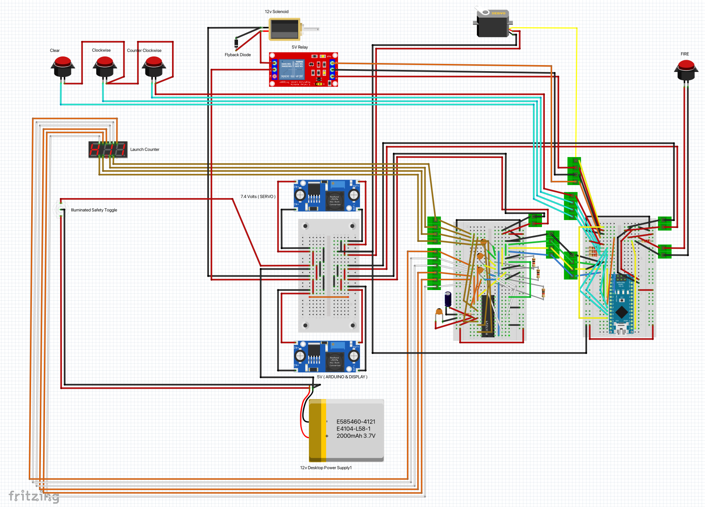

# DART-E : BuildFams Dart Shooter

This build promotes exploration of the effect the launch angle of Nerf darts has on total horizontal distance.

## Features

- 120 PSI powered by pressurized tank
- Single 16v battery stepped down to power:
  - 5V Arduino Nano
  - 5V 3 digit seven segment display
  - 7.6V servo motor
  - 12V solenoid
  - Safety switch
- Fun laser cutter / engraving

## Electronics

## Files

- XTool Laser Cutter Files
- Fritzing files
- Arduino Nano Code
